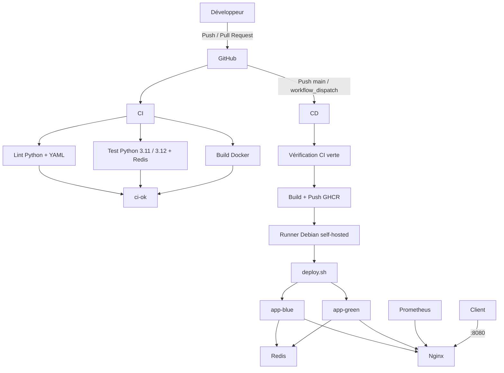

# ESIEA-DEVOPS

Projet d'évaluation DevOps mettant en œuvre :

- conteneurisation Docker ;
- orchestration Docker Compose ;
- CI GitHub Actions ;
- CD vers GitHub Container Registry ;
- déploiement blue/green sur runner self-hosted Debian ;
- métriques et alertes Prometheus.

---

## Architecture



---

## Arborescence

```text
.
├── .github/
│   ├── actions/
│   │   └── python-setup/
│   │       └── action.yml
│   └── workflows/
│       ├── ci.yml
│       └── cd.yml
├── deploy/
│   └── deploy.sh
├── nginx/
│   └── default.conf
├── observability/
│   └── prometheus/
│       ├── alert_rules.yml
│       └── prometheus.yml
├── starter-app/
│   ├── .dockerignore
│   ├── .flake8
│   ├── Dockerfile
│   ├── app.py
│   ├── requirements.txt
│   └── test_app.py
├── .gitignore
├── docker-compose.yml
└── VERSION
```

---

# Lancement local

## Prérequis

```bash
docker version
docker compose version
git --version
```

## Démarrage

Depuis la racine du projet :

```bash
docker compose down
```

Démarrer Redis et l'application blue :

```bash
docker compose --profile blue up -d --build redis app-blue
```

Vérifier leur état :

```bash
docker compose --profile blue ps
```

Démarrer Nginx et Prometheus :

```bash
docker compose up -d nginx prometheus
```

Vérification finale :

```bash
docker compose --profile blue ps
```

État attendu :

```text
app-blue     healthy
redis        healthy
nginx        Up
prometheus   Up
```

---

# Accès aux services

Application via Nginx :

```text
http://localhost:8080
```

Prometheus :

```text
http://localhost:9090
```

Application blue directe :

```text
http://localhost:45001
```

Application green directe :

```text
http://localhost:45002
```

---

# Vérification fonctionnelle

Healthcheck :

```bash
curl -sS http://localhost:8080/health
```

Résultat attendu :

```json
{"status":"ok"}
```

Statut :

```bash
curl -sS http://localhost:8080/status
```

Exemple après déploiement :

```json
{
  "deploy_color": "blue",
  "service": "projet-devops-groupe-demo",
  "version": "1.1.0"
}
```

Compteur Redis :

```bash
curl -sS http://localhost:8080/visits
```

---

# Tests

## Lint Python

```bash
docker compose --profile blue run \
  --rm \
  --no-deps \
  app-blue \
  flake8 .
```

Aucune sortie indique que le lint est valide.

## Pytest

```bash
docker compose --profile blue run \
  --rm \
  app-blue \
  pytest -v
```

Résultat attendu :

```text
4 passed
```

Le test de `/health` utilise réellement Redis.

---

# Docker

Le Dockerfile utilise un build multi-stage :

```text
builder : python:3.12
runtime : python:3.12-slim
```

L'image finale :

- utilise un utilisateur non-root `appuser` ;
- utilise Gunicorn ;
- expose le port `5000` ;
- possède un vrai `HEALTHCHECK` ;
- ne récupère du builder que l'environnement Python nécessaire.

La commande applicative est :

```text
gunicorn --bind 0.0.0.0:5000 app:app
```

Le `.dockerignore` exclut notamment :

```text
.git
.github
.venv
__pycache__
.pytest_cache
coverage.xml
.env
```

---

# Docker Compose

Services configurés :

```text
app-blue
app-green
redis
nginx
prometheus
```

Ports :

```text
app-blue   45001 -> 5000
app-green  45002 -> 5000
nginx       8080 -> 80
prometheus  9090 -> 9090
```

Redis utilise :

```text
redis:7-alpine
```

avec le volume persistant :

```text
redis-data
```

Les applications attendent que Redis soit `healthy` avant leur démarrage.

---

# CI GitHub Actions

Workflow :

```text
.github/workflows/ci.yml
```

Déclencheurs :

```text
push vers main
pull_request vers main
```

Jobs :

```text
lint
test
build
ci-ok
```

La matrice `test` exécute :

```text
Python 3.11
Python 3.12
```

Redis est déclaré comme service GitHub Actions et réellement utilisé par les tests.

La CI fournit également :

- cache pip ;
- rapport JUnit ;
- rapport de couverture XML ;
- artifacts GitHub Actions ;
- lint YAML ;
- build Docker ;
- `timeout-minutes` sur les jobs.

Le job final :

```text
ci-ok
```

échoue si `lint`, `test` ou `build` échoue.

---

# Action GitHub locale

Fichier :

```text
.github/actions/python-setup/action.yml
```

Elle centralise :

```text
installation Python
cache pip
installation requirements.txt
```

Elle est réutilisée par plusieurs jobs afin d'éviter la duplication.

---

# CD GitHub Actions

Workflow :

```text
.github/workflows/cd.yml
```

Déclencheurs :

```text
push vers main
workflow_dispatch
```

Le déclenchement manuel utilise :

```text
environment = production
```

Exemple :

```bash
gh workflow run cd.yml \
  --ref main \
  -f environment=production
```

Le flux est :

```text
main
↓
verification-ci
↓
build-and-push
↓
GHCR
↓
runner self-hosted
↓
deploy.sh
```

---

# GitHub Container Registry

Registry :

```text
ghcr.io/paracelse-itoua/esiea-devops
```

Trois tags sont créés à chaque publication :

```text
latest
SHA court
version SemVer
```

Exemple validé :

```text
latest
5578143
1.1.0
```

La version est lue depuis :

```text
VERSION
```

---

# Permissions GitHub Actions

Le workflow CD utilise le principe du moindre privilège.

Permission globale :

```yaml
permissions: {}
```

Job de vérification CI :

```text
actions: read
```

Build et push :

```text
contents: read
packages: write
```

Déploiement :

```text
contents: read
packages: read
```

L'authentification utilise :

```text
GITHUB_TOKEN
```

Le token n'est pas affiché dans les logs.

---

# Runner self-hosted

Runner utilisé :

```text
esiea-devops-debian13
```

Labels :

```text
self-hosted
Linux
X64
```

La machine Debian possède Docker et le runner fonctionne comme service systemd.

Vérification :

```bash
gh api \
  repos/Paracelse-ITOUA/ESIEA-DEVOPS/actions/runners \
  --jq '.runners[] | {name, status, busy, labels: [.labels[].name]}'
```

---

# Déploiement blue/green

L'état de déploiement est conservé hors du dépôt :

```text
~/.esiea-devops/active_color
~/.esiea-devops/current_sha
~/.esiea-devops/current_version
```

Exemple de bascule :

```text
blue actif
↓
démarrage green
↓
healthcheck
↓
bascule Nginx
↓
healthcheck public
↓
arrêt blue
```

Le déploiement suivant effectue l'inverse.

---

# Healthcheck et rollback

Le déploiement effectue un healthcheck public :

```bash
curl -fsS http://localhost:8080/health
```

avec exactement trois essais.

Si le nouveau déploiement échoue :

```text
Nginx revient sur l'ancienne couleur
↓
la nouvelle couleur est arrêtée
↓
le SHA précédent est re-pull depuis GHCR
↓
l'ancienne application est relancée
↓
le job CD échoue
```

Le SHA précédent est conservé dans :

```text
~/.esiea-devops/current_sha
```

---

# Métriques Prometheus

Endpoint :

```text
/metrics
```

## Compteur HTTP

```text
http_requests_total
```

Labels :

```text
method
endpoint
code
```

Exemple :

```text
http_requests_total{code="200",endpoint="/health",method="GET"}
```

## Histogramme

```text
http_request_duration_seconds
```

Il permet le calcul des latences p95 et p99.

## Version / SHA

```text
app_deploy_info
```

Exemple :

```text
app_deploy_info{sha="5578143",version="1.1.0"} 1.0
```

---

# Alertes Prometheus

## Taux de 5xx

Condition :

```text
taux de 5xx > 5 % sur 5 minutes
```

Durée :

```text
2 minutes
```

Ce délai évite une alerte sur une erreur isolée.

## p95

Condition :

```text
p95 > 500 ms
```

pendant :

```text
2 minutes
```

## p99

Condition :

```text
p99 > 1 seconde
```

pendant :

```text
2 minutes
```

Le p99 permet de détecter les requêtes les plus lentes sans réagir à un pic ponctuel.

Validation :

```bash
docker compose exec -T prometheus \
  promtool check config /etc/prometheus/prometheus.yml
```

```bash
docker compose exec -T prometheus \
  promtool check rules /etc/prometheus/alert_rules.yml
```

---

# Organisation Git

Le projet applique :

```text
une fonctionnalité cohérente
=
une branche
=
une Pull Request
```

Ordre normal :

```bash
git switch main
git pull --ff-only origin main
git switch -c <branche>
```

Après modifications :

```bash
git status --short
git diff
```

Ajouter uniquement les fichiers concernés :

```bash
git add <fichier>
```

Contrôler :

```bash
git diff --cached
git diff --check
```

Commit signé :

```bash
git commit -S -m "type: message ..."
```

Push :

```bash
git push -u origin HEAD
```

PR :

```bash
gh pr create --base main
```

Checks :

```bash
gh pr checks --watch
```

Merge :

```bash
gh pr merge --rebase --delete-branch
```

Synchronisation :

```bash
git switch main
git pull --ff-only origin main
```

---

# Validation finale

Vérifier Git :

```bash
git status
```

Valider Compose :

```bash
docker compose \
  --profile blue \
  --profile green \
  config >/dev/null
```

Lint :

```bash
docker compose \
  --profile green \
  run --rm --no-deps \
  app-green flake8 .
```

Tests :

```bash
docker compose \
  --profile green \
  run --rm \
  app-green pytest -v
```

Application :

```bash
curl -sS http://localhost:8080/health
curl -sS http://localhost:8080/status
```

Métriques :

```bash
curl -sS http://localhost:8080/metrics \
  | grep '^http_requests_total'
```

```bash
curl -sS http://localhost:8080/metrics \
  | grep app_deploy_info
```

Prometheus :

```bash
docker compose exec -T prometheus \
  promtool check config /etc/prometheus/prometheus.yml
```

```bash
docker compose exec -T prometheus \
  promtool check rules /etc/prometheus/alert_rules.yml
```

État de déploiement :

```bash
cat ~/.esiea-devops/active_color
cat ~/.esiea-devops/current_sha
cat ~/.esiea-devops/current_version
```

Runs GitHub :

```bash
gh run list --branch main --limit 10
```

---

# Version

Version actuelle :

```text
1.1.0
```